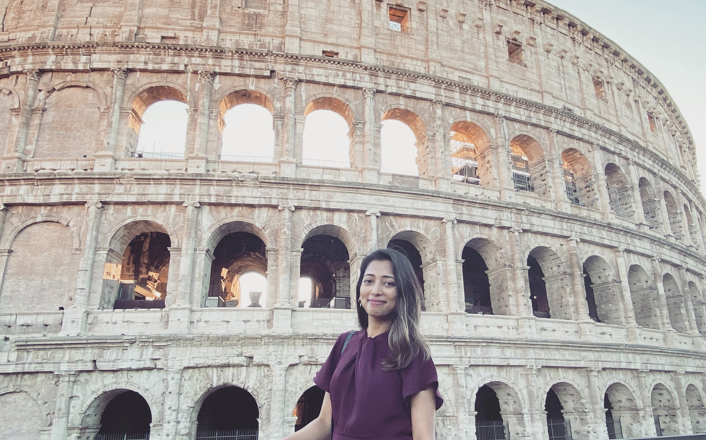

# About Me

Hi, I’m Farhana. A PhD candidate at the [Department of Pharmacology and Toxicology](https://glse.utoronto.ca/farhana-islam-pharmacology-and-toxicology) at the University of Toronto. My doctoral research, in the field of Psychiatric Pharmacogenetics, focuses on identifying genetic variants contributing to antidepressant and antipsychotic drug pharmacokinetics and outcome in individuals with depression and schizophrenia. I conduct my research at the [Pharmacogenetics Research Clinic](https://pgxrc.ca/farhana-islam) at the [Centre for Addiction and Mental Health (CAMH)](https://www.camh.ca/).

I am open to collaborations or to speak about my research. 

**View my CV [here](./another-page.html).**
